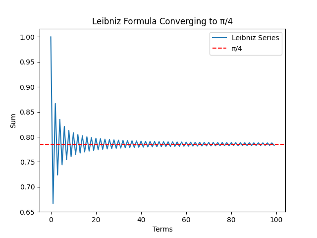
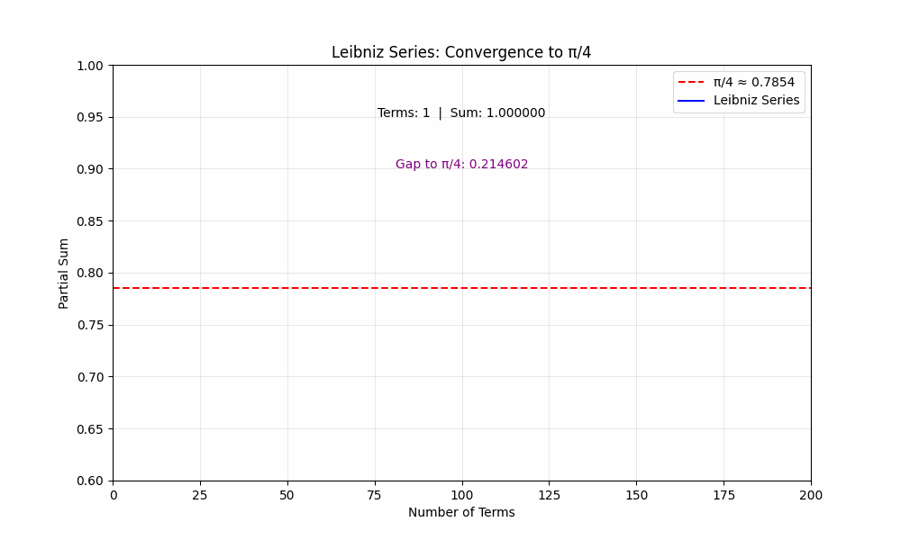

# Why Does π Appear in the Leibniz Formula (Series)?

The **Leibniz formula** for π is given by:

```math
1 - \frac{1}{3} + \frac{1}{5} - \frac{1}{7} + \cdots = \frac{\pi}{4}
```

  

To plot the curve in Python, use the following code, [View `leibniz.py`](Python/leibniz.py).  

At first glance, this series consists of simple fractions with alternating signs, with no apparent connection to geometry. So why does **π** appear? 

## 1. Connection to Geometry & Integration
The key reason is that this series is the **Taylor series** expansion of the arctangent function:

```math
\arctan x = x - \frac{x^3}{3} + \frac{x^5}{5} - \frac{x^7}{7} + \cdots
```

Setting **$x = 1$** gives:

```math
\arctan(1) = 1 - \frac{1}{3} + \frac{1}{5} - \frac{1}{7} + \cdots
```

Since we know that **$\arctan(1) = \frac{\pi}{4}$**, the Leibniz formula follows directly.


## 2. Why is π in arctan(1)?
The arctangent function is closely tied to the **unit circle**. The **angle** whose tangent is 1 in a right triangle is exactly **$45^\circ$** or **$\frac{\pi}{4}$** radians. Thus, when summing the infinite series, π naturally appears.


## 3.Integral Approach

Another way to understand the Leibniz series is through an integral representation:

### Consider the Integral:

```math
\int_0^1 \frac{dx}{1 + x^2}
```

This integral equals:

```math
\arctan(x) \Big|_0^1 = \arctan(1) - \arctan(0) = \frac{\pi}{4} - 0 = \frac{\pi}{4}
```

### Expanding as a Geometric Series

We can expand **$\frac{1}{1 + x^2}$** as a geometric series for **$|x| < 1$**:

```math
\frac{1}{1 + x^2} = 1 - x^2 + x^4 - x^6 + \dots = \sum_{n=0}^{\infty} (-1)^n x^{2n}
```

### Term-by-Term Integration

Now, integrating term-by-term from **0 to 1**:

```math
\int_0^1 \sum_{n=0}^{\infty} (-1)^n x^{2n} dx = \sum_{n=0}^{\infty} (-1)^n \int_0^1 x^{2n} dx
```

Since:

```math
\int_0^1 x^{2n} dx = \left[ \frac{x^{2n+1}}{2n+1} \right]_0^1 = \frac{1}{2n+1}
```

We obtain:

```math
\sum_{n=0}^{\infty} (-1)^n \frac{1}{2n+1} = 1 - \frac{1}{3} + \frac{1}{5} - \dots
```

Thus, we recover the **Leibniz formula**:

```math
\int_0^1 \frac{dx}{1 + x^2} = \frac{\pi}{4} = \sum_{n=0}^{\infty} \frac{(-1)^n}{2n+1}
```

This integral approach provides an elegant connection between **π** and **infinite series**, showing how the Leibniz formula naturally arises from calculus! 

## 4. Unexpected Simplicity

  

To plot the curve in Python, use the following code, [View `leibniz-animation.py`](Python/leibniz-animation.py).  

What makes Leibniz’s formula so fascinating is that it expresses **π using only odd fractions**—no circles, no geometry, just pure numbers! This is a perfect example of **π appearing unexpectedly** in a seemingly unrelated setting.

---
---
# Why Does $\pi$ Appear in the Leibniz Formula? 

(Youtube script)

The appearance of $\pi$ in the Leibniz formula:

$$1 - \frac{1}{3} + \frac{1}{5} - \frac{1}{7} + \dots = \frac{\pi}{4}$$

is surprising because the series itself consists purely of arithmetic—simple fractions with alternating signs. There are no circles, no explicit geometry—so why does  appear?

At first glance, the Leibniz series is just an infinite sum of fractions, but its connection to $\pi$ is rooted in trigonometry. The key insight comes from the arctangent function, which describes the angle in a right triangle given the ratio of the opposite and adjacent sides.

The series arises naturally when we expand the function $\arctan(x)$, which tells us the angle whose tangent is . Specifically, when , the angle is precisely  or  radians. This is why adding up fractions in the Leibniz series ultimately gives a result tied to . It’s a bridge between an arithmetic sum and a geometric reality.

The key lies in the unit circle. The function $\arctan(x)$ is deeply connected to circular motion and the fundamental properties of right triangles. If you take a unit circle (a circle with radius 1), the angle that corresponds to a slope of 1 (meaning the opposite and adjacent sides of a right triangle are equal) is exactly . Since the arctangent function gives us this angle, and the Leibniz series is its expansion at , the connection to  is unavoidable.

Another way to understand the appearance of  is through integration. Consider the integral:

$$\int_0^1 \frac{dx}{1 + x^2}$$

This integral represents the area under a curve, but surprisingly, its result is directly tied to the arctangent function. Evaluating it at $x = 1$ gives exactly $\frac{\pi}{4}$.

What makes this remarkable is that when we expand the fraction inside the integral as a geometric series, we recover the same alternating sum seen in Leibniz’s formula. This means that the sum of simple fractions is secretly measuring the accumulated effect of tiny changes in an angle along the unit circle.

What makes the Leibniz formula so striking is that it reveals  without any obvious reference to circles. There are no circumferences or diameters—just an infinite sum of fractions. And yet, when followed to its logical conclusion, the connection to geometry becomes undeniable.

This is one of the great surprises in mathematics: fundamental constants like  appear in places we least expect. The interplay between infinite series, integration, and geometry showcases the deep unity of mathematics, where a simple pattern of numbers encodes the essence of a perfect circle.

