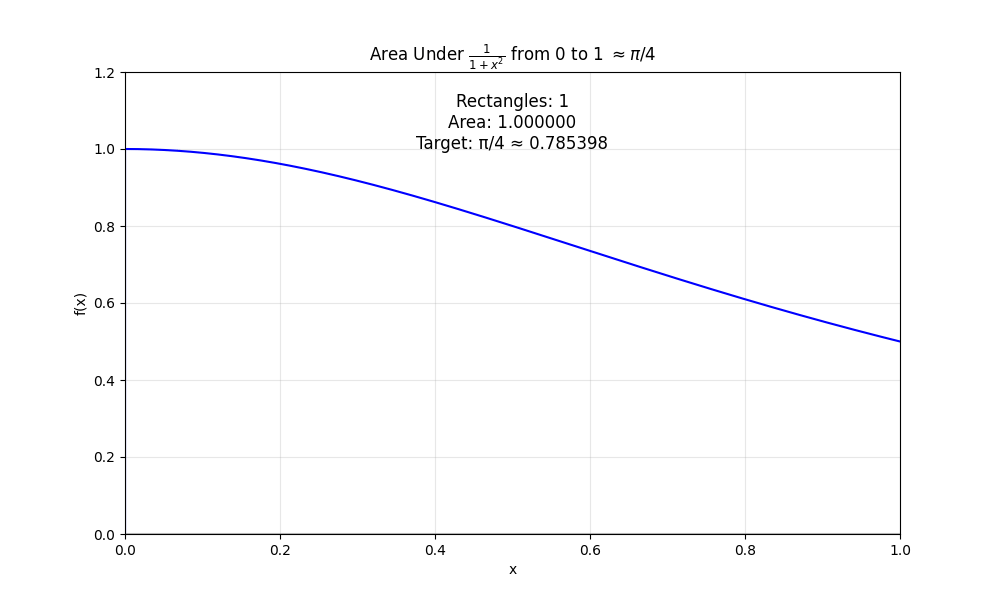

# Why Does π Appear in the Leibniz Formula (Series)?

The **Leibniz formula** for π is given by:

```math
1 - \frac{1}{3} + \frac{1}{5} - \frac{1}{7} + \cdots = \frac{\pi}{4}
```

  

To plot the curve in Python, use the following code, [View `leibniz.py`](Python/leibniz.py).  

At first glance, this series consists of simple fractions with alternating signs, with no apparent connection to geometry. So why does **π** appear? 

## 1. Connection to Geometry & Integration
The key reason is that this series is the **Taylor series** expansion of the arctangent function:

```math
\arctan x = x - \frac{x^3}{3} + \frac{x^5}{5} - \frac{x^7}{7} + \cdots
```

Setting **$x = 1$** gives:

```math
\arctan(1) = 1 - \frac{1}{3} + \frac{1}{5} - \frac{1}{7} + \cdots
```

Since we know that **$\arctan(1) = \frac{\pi}{4}$**, the Leibniz formula follows directly.


## 2. Why is π in arctan(1)?
The arctangent function is closely tied to the **unit circle**. The **angle** whose tangent is 1 in a right triangle is exactly **$45^\circ$** or **$\frac{\pi}{4}$** radians. Thus, when summing the infinite series, π naturally appears.


## 3.Integral Approach

Another way to understand the Leibniz series is through an integral representation:

### Consider the Integral:

```math
\int_0^1 \frac{dx}{1 + x^2}
```

  

To plot the curve in Python, use the following code, [View `riemann_area_pi4.py`](Python/riemann_area_pi4.py).  
This integral equals:

```math
\arctan(x) \Big|_0^1 = \arctan(1) - \arctan(0) = \frac{\pi}{4} - 0 = \frac{\pi}{4}
```

### Expanding as a Geometric Series

We can expand **$\frac{1}{1 + x^2}$** as a geometric series for **$|x| < 1$**:

```math
\frac{1}{1 + x^2} = 1 - x^2 + x^4 - x^6 + \dots = \sum_{n=0}^{\infty} (-1)^n x^{2n}
```

### Term-by-Term Integration

Now, integrating term-by-term from **0 to 1**:

```math
\int_0^1 \sum_{n=0}^{\infty} (-1)^n x^{2n} dx = \sum_{n=0}^{\infty} (-1)^n \int_0^1 x^{2n} dx
```

Since:

```math
\int_0^1 x^{2n} dx = \left[ \frac{x^{2n+1}}{2n+1} \right]_0^1 = \frac{1}{2n+1}
```

We obtain:

```math
\sum_{n=0}^{\infty} (-1)^n \frac{1}{2n+1} = 1 - \frac{1}{3} + \frac{1}{5} - \dots
```

Thus, we recover the **Leibniz formula**:

```math
\int_0^1 \frac{dx}{1 + x^2} = \frac{\pi}{4} = \sum_{n=0}^{\infty} \frac{(-1)^n}{2n+1}
```

This integral approach provides an elegant connection between **π** and **infinite series**, showing how the Leibniz formula naturally arises from calculus! 

## 4. Unexpected Simplicity

  

To plot the curve in Python, use the following code, [View `leibniz-animation.py`](Python/leibniz-animation.py).  

What makes Leibniz’s formula so fascinating is that it expresses **π using only odd fractions**—no circles, no geometry, just pure numbers! This is a perfect example of **π appearing unexpectedly** in a seemingly unrelated setting.

---
---
# Why Does $\pi$ Appear in the Leibniz Formula? 

(Youtube script)

The Leibniz formula:

$$1 - \frac{1}{3} + \frac{1}{5} - \frac{1}{7} + \dots = \frac{\pi}{4}$$


is surprising because it consists purely of arithmetic—simple fractions with alternating signs—yet somehow produces π/4. Without circles or explicit geometry in the formula itself, why does π emerge?

The answer lies in the arctangent function, which describes the angle in a right triangle given the ratio of the opposite and adjacent sides. The Leibniz series is actually the Taylor expansion of arctan(x) evaluated at x=1, where the angle equals precisely π/4 (or 45 degrees).
This connection becomes clear through integration. The integral:

$$\int_0^1 \frac{dx}{1 + x^2}$$

represents the area under a curve and equals arctan(1) = π/4. When we expand the fraction inside as a geometric series, we recover the same alternating sum seen in Leibniz's formula.
The key insight involves the unit circle: arctan(x) measures the angle corresponding to a given slope. When that slope is 1, the angle is exactly 45 degrees on the unit circle. So this simple sum of fractions is secretly measuring angular changes along a circle.
This reveals the deep unity of mathematics—where a pattern of simple fractions encodes the essence of a perfect circle, and π appears unexpectedly at the intersection of algebra and geometry.


